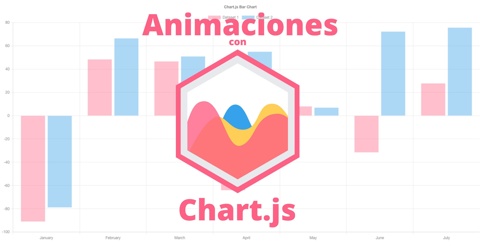

<h1 align="center"> PROY-3 DASHBOARD </h1>

## Información General
***
Este proyecto se trata de un dashboard en donde se consume una API y de la información obtenida se crea un grafico con chartjs. 

### Screenshot


## Instalación
***
Se tiene que crear un repositorio en github y se agrega la url creada a la terminal para tener el codigo en git 
```
$ git clone https://github.com/cquidenao/proy-3dashboard.git
```
